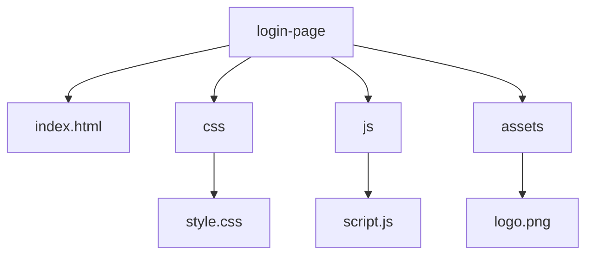

# 登录页面开发计划

## 项目目标
创建一个现代化的前端登录页面，包含响应式布局、美观的 UI 设计、表单验证功能以及交互效果，使用纯 HTML、CSS 和 JavaScript 实现，UI 设计简洁并包含一个自定义 Logo，同时添加注册按钮和链接。

## 项目结构
项目将组织在一个名为 `login-page` 的新目录中，结构如下：

- `login-page/`
  - `index.html` - 主页面文件
  - `css/`
    - `style.css` - 样式文件
  - `js/`
    - `script.js` - 脚本文件
  - `assets/`
    - `logo.png` - 自定义 Logo 图片（假设用户会提供）

## 开发步骤
1. **创建项目目录和文件结构**：在 `login-page` 目录中创建必要的文件夹和文件。
2. **HTML 结构**：编写 `index.html`，包含品牌 Logo、用户名和密码输入框、记住密码选项、登录按钮、忘记密码链接以及注册按钮和链接。
3. **CSS 样式**：在 `style.css` 中实现响应式布局，适配不同设备屏幕尺寸，并设计美观的 UI，包括输入框聚焦时的样式变化、登录按钮和注册按钮的悬停效果。
4. **JavaScript 功能**：在 `script.js` 中实现表单验证功能，确保用户名和密码不为空且符合基本格式要求；添加交互效果，如加载状态的显示，并为注册按钮和链接添加简单的导航逻辑（例如跳转到注册页面）。
5. **测试和调整**：在不同设备和浏览器上测试页面，确保响应式布局和交互效果正常工作，根据需要进行调整。

## Mermaid 图表 - 项目结构


## Mermaid 图表 - 开发流程
```mermaid
graph TD
    A[创建项目目录和文件结构] --> B[编写HTML结构]
    B --> C[设计CSS样式]
    C --> D[实现JavaScript功能]
    D --> E[测试和调整]